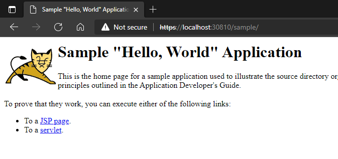

# java-jenkins-techdemo
> This project is purely intended as a sandbox demonstration environment for creating a containerised CI/CD pipeline with Jenkins for a sample Java app. Nothing in here should be used anywhere other than in a local testing environment for educational purposes.

A simple Jenkins pipeline for a sample Java app.


## Jenkins Pipeline

<u>Specifications</u>

1. Log  files saved to persistent storage.
2. SSL termination inside the container with self-signed certificates
3. Application to be accessible over both http and https.
4. Use Jenkins to poll Git every 15m for changes

<u>Toolset</u>

- Github for source control (this repo)
- Minikube (shown using integrated version of Docker for Windows on WSL2)
- Azure DevOps Public Project [jenkins-java-techdemo](https://dev.azure.com/cronjevh-techdemo/jenkins-java-techdemo) for work tracking band backlog.
- [Typora](https://typora.io/) for markdown formatting

<u>Assumptions</u>

- [Tomcat Sample app](https://tomcat.apache.org/tomcat-8.5-doc/appdev/sample/) is expected to run unmodified. 

## Usage

Fork this project .. 

Assuming Powershell is available, with a kubectl context set to local Kubernetes

```powershell
cd .\build
.\run-jenkins-in-kubernetes.ps1 # Builds Dockerfile and deploy to k8s
```

Once completed, and the pod is running, you can connect to http://localhost:30808 to get to Jenkins Interface

In Jenkins, add a github ssh credential to your forked repo

Create a new Pipeline, using the contents of the Jenkinsfile in this repo, and update to your forked repo address.

Jenkins builds and deploys the ./src/Dockerfile and updates a k8s deployment in the local cluster which can be accessed through https://localhost:30810/sample/



## Known loose ends

3. Dockerfiles should included automated test suites - there's little to test at this stage.
4. [Snyk Docker security scans](https://dev.azure.com/cronjevh-techdemo/jenkins-java-techdemo/_workitems/edit/18) should be included as part of the Docker build process.

## Optional Extras

.. nobody asked for, but still fun to do ..

1. Added Powershell Core to the Jenkins Docker image (I just prefer it for scripting, although it turned out I didn't use)
2. A publicly visible [Azure DevOps Project jenkins-java-techdemo](https://dev.azure.com/cronjevh-techdemo/jenkins-java-techdemo) was created for this demo. (Using project management tools saves more time in the long run)

